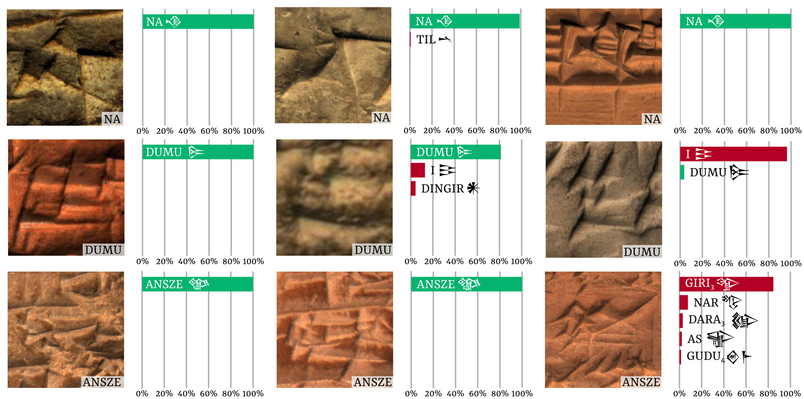

# Signs of the Past, Patterns of the Future
This repository contains the source code for our paper: "Signs of the Past, Patterns of the Present: On the Automatic
Classification of Old Babylonian Cuneiform Signs."



### 🤗 Check our interactive demo on Hugging Face!
[](https://huggingface.co/spaces/verwimpe/Cune-AI-form)

It allows testing the tablets of our validation set, which works nicely. You can upload your own images as well,
but they are not guaranteed to work great when they are not Old-Babylonian tablets from around the same area. 

### 📄 Check our paper on arXiv!
[](https://arxiv.org/abs/1234.56789)

Abstract:
> The work in this paper describes the training and evaluation of machine learning (ML) techniques for the classification of cuneiform signs. There is a lot of variability in cuneiform signs, depending on where they come from, for what and by whom they were written, but also how they were digitized. This variability makes it unlikely that an ML model trained on one dataset will perform successfully on another dataset. This contribution studies how such differences impact that performance. Based on our results and insights, we aim to influence future data acquisition standards and provide a solid foundation for future cuneiform sign classification tasks. The ML model has been trained and tested on handwritten Old Babylonian (c. 2000-1600 B.C.E.) documentary texts inscribed on clay tablets originating from three Mesopotamian cities (Nippur, Dūr-Abiešuḫ and Sippar). The presented and analysed model is ResNet50, which achieves a top-1 score of 87.1% and a top-5 score of 96.5% for signs with at least 20 instances. As these automatic classification results are the first on Old Babylonian texts, there are
currently no comparable results.


### Data preparation
The full tablet images are currently hosted on IIIF links at the UGent. The code in this repo will automatically
download the available tablets and crop the signs out of the available images, provided that you have access to 
the annotations. 

Crops can be created by simply running (but check the parameters inside the script first):
```
python prepare_data.py
```

### Training
Run train class.py with the appropriate `exp_id`. The hyperparameters for every experiment are in [class_experiments.csv](./exp_configurations/class_experiments.csv), which includes the experiment id necessary.

```
python train_class.py [exp_id]
```

The experiment ids that are included in our paper will be included here soon.

### Analysis tools
The current repository contains many tools to inspect and analyze how well a machine learning model works. Instructions and demo files will be added to this repository soon.